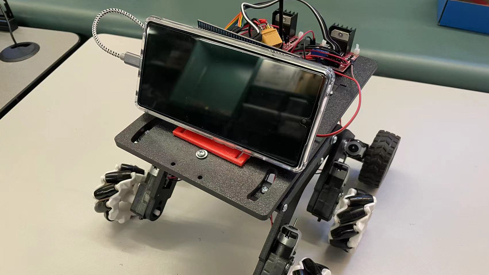

## About the POD

POD is smartphone that flies, as a new way to achieve hands-free, eyes-up mobile computing. Unlike existing drone-carried user interfaces, POD features a smartphone-sized display and the computing as well sensing power of a modern smartphone. We are visioning about giving phone wings, wheels and arms.

Full repo list can be found [here](https://github.com/yecl-pod).

### Original POD
The very first POD uses the first version of our flight control (which is based on [crazyflie-firmware](https://github.com/bitcraze/crazyflie-firmware)) with motors from DJI Tello drone and 3D printed frame. Though it flies badly, it helps me learn a lot about the drone theory.

{: width="500" }

### POD-Mini
Then we improved our mechanical design and replace the brushed motors with more powerful brushless mini-motors. Even with increased payload, the drone can barely able to carry a reduced Pixel 4 smartphone which includes the screen panel without glass, motherboard, front camera module, and the battery. We implement the [PoseNet](https://github.com/tensorflow/tfjs-models/tree/master/posenet) on the Pixel 4 and make the POD track and follow people. The paper can be found here [POD: A Smartphone That Flies](https://dl.acm.org/doi/10.1145/3469259.3470490) and we also have the [demo video](https://youtu.be/_ZVm9seYu1o).

{: width="500" }

The related git repos are: [POD-Firmware](https://github.com/yecl-pod/POD-Firmware), [POD-Bootloader](https://github.com/yecl-pod/POD-Bootloader), [PoseNet Tracker](https://github.com/flyingphone/posenet_tracker), and [Text Stabilization](https://github.com/yecl-pod/text_stabilization).

### POD-DJI
This time, we further upgrade the POD by taking the DJI Mini as the frame.
{: width="500" }

### POD-V2
Because the DJI mini frame only has limited payload and it's struggle to carry an extra Pixel4. We designed a new frame with much powerful motors and CNC carbon fiber protector. Here are the demos of user following, remote touch, face expression recognition and SLAM.

<iframe width="480" height="270" src="https://www.youtube.com/embed/7vzYMXZFKa4" frameborder="0" allow="autoplay; encrypted-media" allowfullscreen></iframe>
<iframe width="480" height="270" src="https://www.youtube.com/embed/7vzYMXZFKa4" frameborder="0" allow="autoplay; encrypted-media" allowfullscreen></iframe>

The latest flight control hardware: [POD-Micromod-STM32](https://github.com/yecl-pod/POD-Micromod-STM32), [POD-Micromod-Extension](https://github.com/yecl-pod/POD-Micromod-Extension)

### POD-Lambor
For safety concern, we also have a terrestrial version of POD which gives the smartphone wheels. This setup use a cheap robot kit, L298N motor drivers, and a STM32F407 discovery board as the controller. A simplified version of POD flight controller is running on the discovery board, we provide a simple API for android program to communicate with the controller through a USB connection.

{: width="500" }

Android side code:
[AndroidUsbSerial](https://github.com/yecl-pod/AndroidUsbSerial), embedded firmware: [STM32F407DiscoveryCar](https://github.com/yecl-pod/STM32F407DiscoveryCar)

### POD-Geese Chaser
Over the past 30 years, the Canadian geese population in the United States has sharply increased. They can take up residence in public and private spaces such as parks, beaches, and golf courses. Geese's activities will degrade the quality of the above areas. Traditional solution is using trained dogs to expel these invaders. However, we introduce the POD Geese Chaser which is much cheaper and can identify and chase only geese within a digitally defined region.

{: width="500"}
<iframe width="500" height="281" src="https://www.youtube.com/embed/7vzYMXZFKa4" frameborder="0" allow="autoplay; encrypted-media" allowfullscreen></iframe>

Android side code:
[POD Geese Chaser](https://https://github.com/yecl-pod/POD-Geese-Chaser).

### Contact
**Ph.D. Student** Guojun Chen: <guojun.chen@yale.edu>

**Undergraduate Student**
- Noah Weiner: <noah.weiner@yale.edu>
- Yichen Cai: <cai-yc18@mails.tsinghua.edu.cn>
- Justin Aubin: <justin.aubin@yale.edu>
- Aman Heyer: <aman.heyer@yale.edu>
- Maansi Dasari: <maansi.dasari@yale.edu>
- Sam Detor: <sam.detor@yale.edu>
- Stefan-Cristian Roata: <stefan.roata@u.yale-nus.edu.sg>

**Prof.**  Lin Zhong: <lin.zhong@yale.edu>